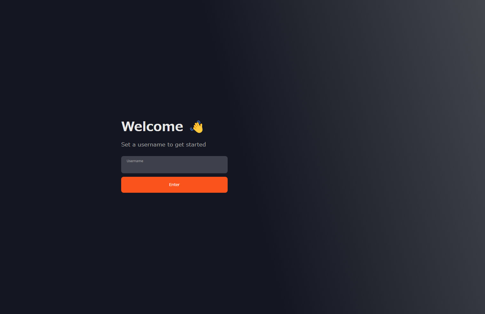
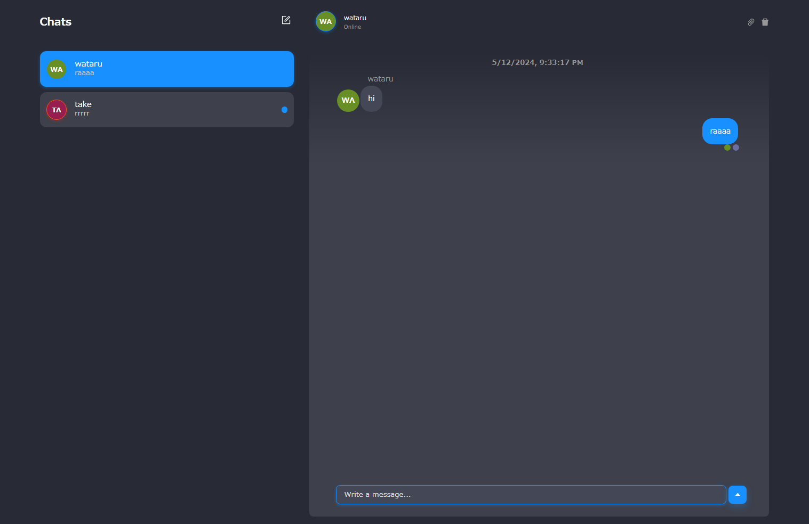
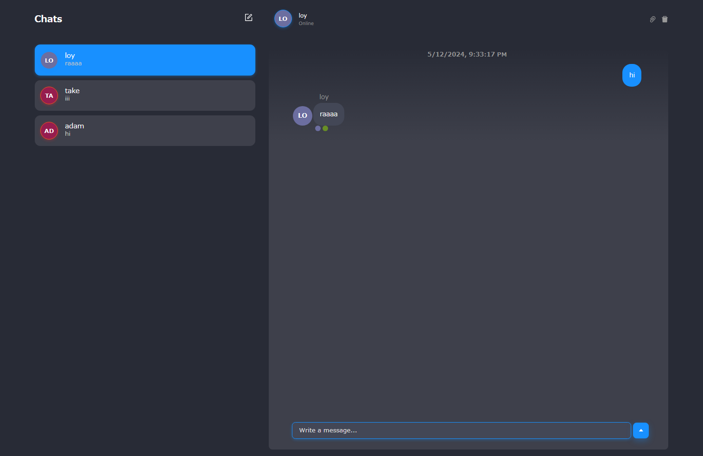

# simple-chat-app



## how to install 
```
git clone https://github.com/wataruyo/simple-chat-app.git
npm install
```
## how to run the app
run this in the backend directory
```
npm run start
```
and then, run this in the frontend directory
```
npm run dev
```

